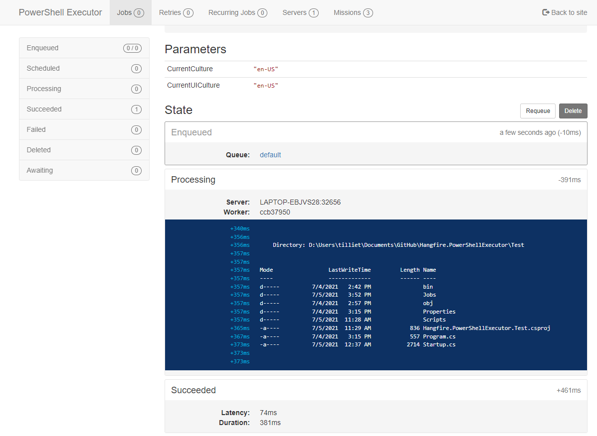

#  PowerShellExecutor

[](https://www.nuget.org/packages/Hangfire.PowerShellExecutor/)
[](https://www.nuget.org/packages/Hangfire.PowerShellExecutor/)
[](https://github.com/thomas-illiet/Hangfire.PowerShellExecutor/actions/workflows/build-and-test.yml)
[](https://github.com/thomas-illiet/Hangfire.PowerShellExecutor/actions/workflows/codeql-analysis.yml)


A plugin for Hangfire that allows you to easily launch your powershell scripts.



*In this screenshot i'm using [MissionControl](https://github.com/ahydrax/Hangfire.MissionControl) to facilitate the creation of jobs.*

Read about hangfire here: <https://github.com/HangfireIO/Hangfire> here: <http://hangfire.io>

## Features

* **Noob Friendly**: Allow to easily launch your powershell scripts.
* **100% Safe**: no Hangfire-managed data (e.g. jobs, states) is ever updated, hence there's no risk to corrupt it.
* *(blah-blah-blah)*

## Setup

Install NuGet package, and configure the [console](https://github.com/pieceofsummer/Hangfire.Console) in .NET Core's Startup.cs:

```c#
public void ConfigureServices(IServiceCollection services)
{
    services.AddHangfire(config =>
    {
        config.UseMemoryStorage();
        config.UseConsole();
    });
    services.AddPSExecutorExtensions();
}
```

Otherwise,

```c#
GlobalConfiguration.Configuration
    .UseMemoryStorage()
    .UseConsole();
services.AddPSExecutorExtensions();
```

**NOTE**: If you have Dashboard and Server running separately, you'll need to call `UseConsole()` on both.

## Example

```C#
using Hangfire.MissionControl;
using Hangfire.Server;
using System.Threading;

namespace Hangfire.PowerShellExecutor.Test
{
    [MissionLauncher(CategoryName = "TestSuite")]
    public class TestSuite
    {
        private readonly PSExecutorBuilder _executorBuilder;

        public TestSuite (PSExecutorBuilder executorBuilder)
        {
            _executorBuilder = executorBuilder;
        }

        public void WithInjection(PerformContext context, CancellationToken cancellationToken)
        {
            var localProcess = _executorBuilder
                .SetCommand("Get-ChildItem")
                .SetExecutionPolicy(PSExecutionPolicy.Bypass)
                .Build();
            localProcess.Start(cancellationToken);
        }

        public void WithoutInjection(PerformContext context, CancellationToken cancellationToken)
        {
            var localProcess = new PSExecutorBuilder(context)
                .SetCommand("Get-ChildItem")
                .SetExecutionPolicy(PSExecutionPolicy.Bypass)
                .Build();
            localProcess.Start(cancellationToken);
        }

        public void WithParameter(PerformContext context, CancellationToken cancellationToken)
        {
            var localProcess = new PSExecutorBuilder(context)
                .AddParameter("PE_TEST01", "TEST01")
                .AddParameter("PE_TEST02", "TEST02")
                .SetCommand("Get-ChildItem -Path Env:")
                .SetExecutionPolicy(PSExecutionPolicy.Bypass)
                .Build();
            localProcess.Start(cancellationToken);
        }

        public void WithSecret(PerformContext context, CancellationToken cancellationToken)
        {
            var localProcess = new PSExecutorBuilder(context)
                .AddSecret("PE_TEST01", "8SE2vsPH$AZrGHq4u*t")
                .AddSecret("PE_TEST02", "xr^!!DjA7C**7YyH%AF")
                .SetCommand("Get-ChildItem -Path Env:")
                .SetExecutionPolicy(PSExecutionPolicy.Bypass)
                .Build();
            localProcess.Start(cancellationToken);
        }

        public void WithExternalFile(PerformContext context, CancellationToken cancellationToken)
        {
            var localProcess = new PSExecutorBuilder(context)
                .SetFile(@"D:\Scripts\FileScript.ps1")
                .SetExecutionPolicy(PSExecutionPolicy.Bypass)
                .Build();
            localProcess.Start(cancellationToken);
        }

        public void WithError(PerformContext context, CancellationToken cancellationToken)
        {
            var localProcess = new PSExecutorBuilder(context)
                .SetCommand("Write-Error 'Test''")
                .SetExecutionPolicy(PSExecutionPolicy.Bypass)
                .Build();
            localProcess.Start(cancellationToken);
        }
    }
}

```

## License

Authored by: Thomas ILLIET

This project is under MIT license. You can obtain the license copy [here](https://github.com/thomas-illiet/Hangfire.PowerShellExecutor/blob/master/LICENSE).
